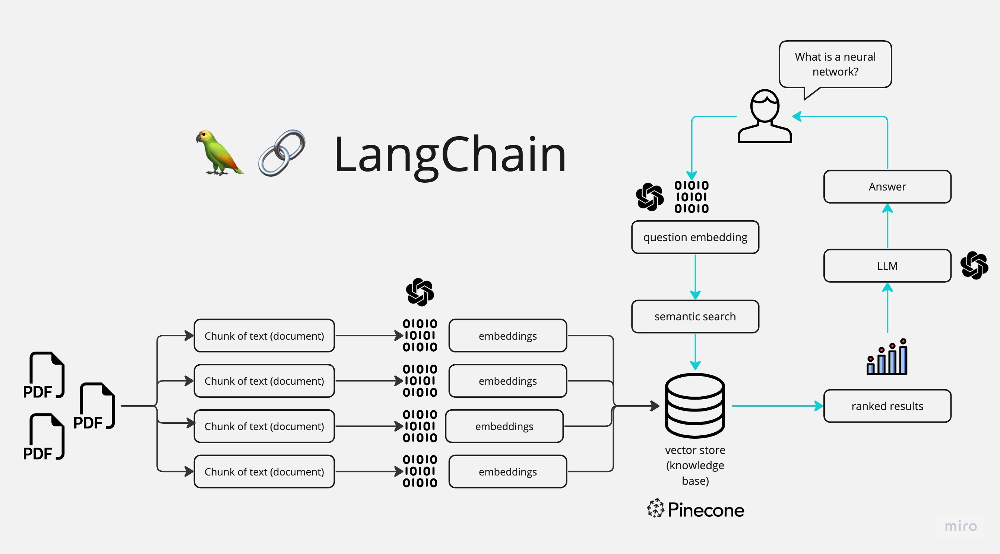

# Chat with your PDFs



# Tech stack
- Langchain
- streamlit
- openai
- HuggingFaceHub
- PyPDF2


# What is this project
Utilizing Langchain technology and a large language model, our project showcases a user-friendly chat interface enabling seamless interaction. Users can effortlessly upload PDF files and inquire about specific content through this chatbot feature, as depicted in the accompanying visual demonstration

# How to use it
1. Clone the repository
2. Install all necessary dependencies
   Ensure you have all these denpendencies install:
   - LangChain
   - PyPDF2
   - Streamlit
   - InstructorEmbedding
   - sentence_transformers
3. Run the application
    ```
   python app.py
   streamlit run app.py
   ```